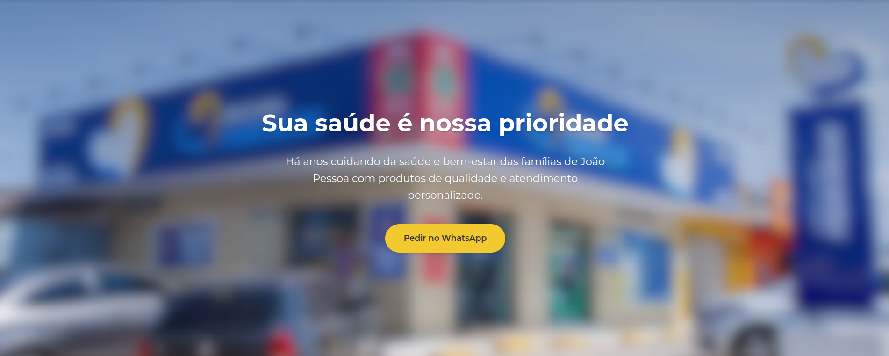
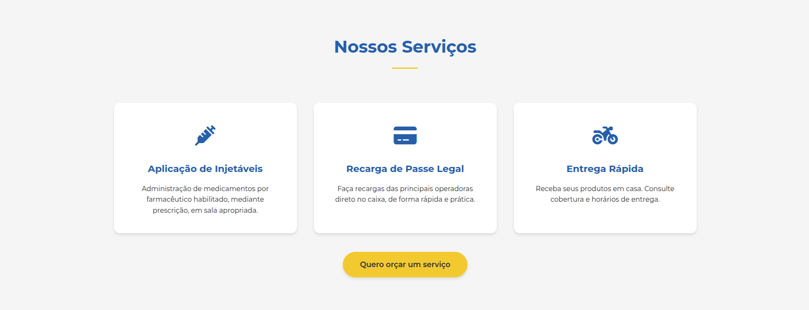
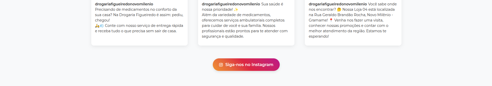
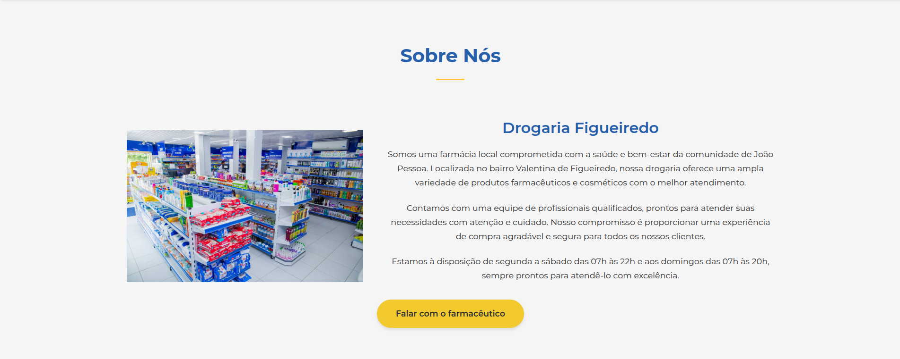
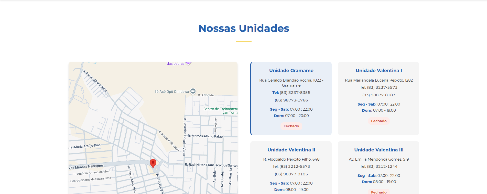
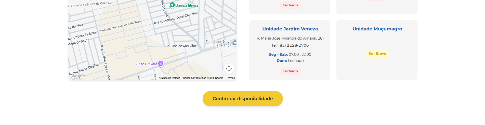
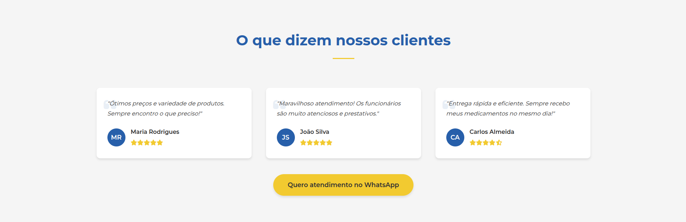
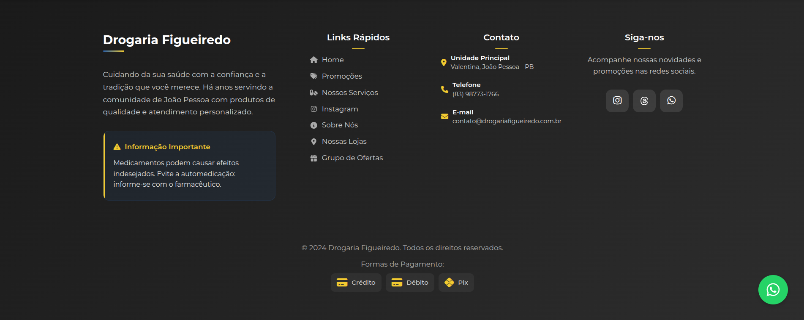

# 💊 Drogaria Figueiredo

<div align="center">
  
  
  <h3>🏪 Pharmacy Chain in João Pessoa - PB, Brazil</h3>
  <p><strong>Health, Promotions and Quality Service</strong></p>
  
  [](https://drogariafigueiredo.com.br/)
  [](https://www.instagram.com/drogariafigueiredonovomilenio/)
  [_98773--1766-25D366?style=for-the-badge&logo=whatsapp)](https://wa.me/5583987731766)
  
</div>

---

## 📋 About the Project

This repository contains the source code for the official website of **Drogaria Figueiredo**, a pharmacy chain located in João Pessoa, Paraíba, Brazil. The website provides a complete digital experience for customers, facilitating access to information about products, services, and store locations.

### 🎯 Objective

To provide a modern and accessible digital platform that connects Drogaria Figueiredo to its customers, offering:

- Information about products and promotions
- Store locations and opening hours
- WhatsApp communication channel
- Access to social media and relevant content

## 🌐 Website Access

The website is available in production at: **[https://drogariafigueiredo.com.br/](https://drogariafigueiredo.com.br/)**

## 📸 Screenshots

### Desktop

<div align="center">
  
  <p><em>Homepage with main banner and call-to-action</em></p>
</div>

<div align="center">
  
  <p><em>Promotions and benefits section</em></p>
</div>

<div align="center">
  
  <p><em>Services offered by the pharmacy</em></p>
</div>

<div align="center">
  
  <p><em>Instagram integration</em></p>
</div>

<div align="center">
  
  <p><em>Institutional information</em></p>
</div>

<div align="center">
  
  <p><em>Store locations</em></p>
</div>

<div align="center">
  
  <p><em>Customer reviews</em></p>
</div>

<div align="center">
  
  <p><em>CTA for WhatsApp offers group</em></p>
</div>

<div align="center">
  
  <p><em>Footer with contact information</em></p>
</div>

### Mobile

<div align="center">
  
  
  <p><em>Responsive mobile version</em></p>
</div>

<div align="center">
  
  
  <p><em>Navigation and content optimized for mobile devices</em></p>
</div>

## 🚀 Technologies Used

<div align="center">
  
  
  
  
  
  
</div>

### 📚 Detailed Stack

- **HTML5** - Semantic and accessible structure
- **CSS3** - Modern styling with CSS variables, Flexbox and Grid
- **Vanilla JavaScript** - Interactivity without external dependencies
- **Font Awesome 6.4.0** - Icon library
- **Google Fonts (Montserrat)** - Professional typography
- **Responsive Design** - Adaptive layout for all devices
- **Optimized SEO** - Structured meta tags and Schema.org
- **Progressive Enhancement** - Guaranteed basic functionality

## 📁 Project Structure

```
drogaria-figueiredo/
├── README.md
└── site/
    ├── index.html          # Main page
    ├── styles.css          # Global styles
    ├── script.js           # JavaScript functionalities
    └── assets/
        ├── favicon.ico
        └── images/
            ├── banners/    # Responsive banners
            │   ├── desktop/
            │   ├── tablet/
            │   └── mobile/
            ├── logos/      # Logos and brands
            ├── posts/      # Instagram images
            ├── screenshots/# Screenshots
            └── store/      # Store images
```

## ✨ Main Features

### 🎨 Interface & Experience

- **Responsive Design** - Adapted for desktop, tablet and mobile
- **Hamburger Menu** - Optimized navigation on mobile devices
- **Smooth Scroll** - Smooth navigation between sections
- **Banner Carousel** - Automatic rotation of offers
- **Animations** - Smooth transitions and visual feedback

### 📱 Integrations

- **WhatsApp Business** - Direct links for customer service
- **Instagram Feed** - Display of latest posts
- **Google Maps** - Store locations (ready for integration)
- **Offers Group** - CTA for exclusive WhatsApp group

### 🔧 Optimizations

- **Performance** - Image lazy loading
- **SEO** - Meta tags, Open Graph and Schema.org
- **Security** - Configured Content Security Policy
- **Accessibility** - Semantic structure and alt texts

## 🏪 Stores

Drogaria Figueiredo has 5 active stores and 1 coming soon:

1. **Gramame Store** - R. Geraldo Brandão Rocha, 1022
2. **Valentina I Store** - R. Mariângela Lucena Peixoto, 1282
3. **Valentina II Store** - R. Flodoaldo Peixoto Filho, 648
4. **Valentina III Store** - Av. Emília Mendonça Gomes, 519
5. **Jardim Veneza Store** - R. Maria José Miranda do Amaral, 281
6. **Muçumagro Store** - Coming soon

## 📞 Contact

- **Main Phone:** (83) 98773-1766
- **Instagram:** [@drogariafigueiredonovomilenio](https://www.instagram.com/drogariafigueiredonovomilenio/)
- **Email:** contato@drogariafigueiredo.com.br
- **Website:** [https://drogariafigueiredo.com.br/](https://drogariafigueiredo.com.br/)

## 🕐 Opening Hours

- **Monday to Saturday:** 07:00 AM to 10:00 PM
- **Sunday:** 07:00 AM to 08:00 PM

\*Hours may vary by store

## 📈 Metrics & Performance

- **Lighthouse Score:** Optimized for web performance
- **Mobile-First:** Priority design for mobile devices
- **Cross-Browser:** Compatible with modern browsers
- **Loading Time:** Optimized for fast loading

## ⚠️ Important Notices

- Medications may cause unwanted effects
- Avoid self-medication: consult with the pharmacist
- Products subject to stock availability
- Promotions valid according to regulations

## 📄 License and Rights

**© 2024 Drogaria Figueiredo. All rights reserved.**

This is a proprietary project of Drogaria Figueiredo. The source code and all related assets are the exclusive property of the company and are not available for public or commercial use without express authorization.

---

<div align="center">
  <strong>Drogaria Figueiredo - Caring for your health with the trust and tradition you deserve</strong>
  
  <br><br>
  
  
</div>
